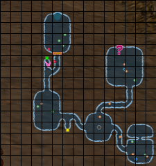
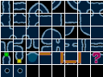
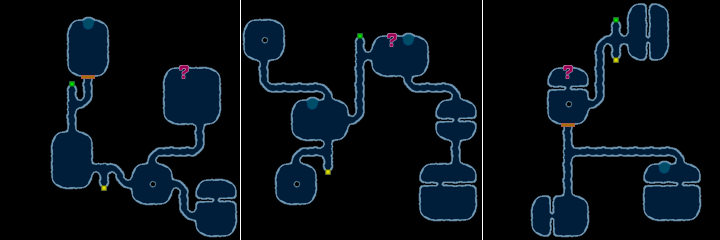
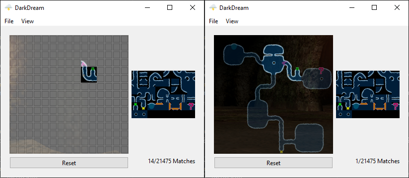

# DarkDream

A Python tool to predict dungeon generation in the PS2 title "Dark Cloud".

## How does it work?

### The Basics
Before generating a dungeon the game runs the following code: `srand(rand()/100000.0f);`. Since `RAND_MAX` is 231 - 1, this dramatically limits the seed count from 232 to `RAND_MAX` / 100000 + 1 (i.e. 21475).

With that information in mind, the search space becomes reasonable to brute force and generate all of the maps by "hand" without the need to reverse engineer the dungeon generation algorithm. These maps are generated and stored internally in a 20x20 grid for display on the minimap. However, the true dungeon size remains in a 15x15 subsection of this grid as seen below.

  
  

Through the use of [scripting](./tools/generate_dungeons.py), all 21475 maps can be precomputed in less than 24 hours. With the above tileset and the information from the [precomputed file](./res/maps.json) any dungeon can be rendered into an image like the following dungeons.

  

### Image Recognition

By capturing the game feed and cropping to the selection of the map, the dungeon can automatically be determined using the tileset. This is done by precomputing the entire tileset's [phash](https://en.wikipedia.org/wiki/Perceptual_hashing). Every frame the app will compare each tile's hash to the precomputed hash. If this hash gives a similarity greater than a threshold then that tile is determined to be a match.

  

## Known Issues

1. Map generation will change based on the dungeon and any obstacles that may be crossed with specific characters. Also, there are certain floors which are "Limit Zones" forcing characters to be used and limiting obstacles. Thus, this program is currently only limited to the opening section of the game in Divine Beast Cavern before Xiao is unlocked.

2. Atla contents has the ability to be randomized upon entering the floor of a dungeon. Some instances of atla are fixed in what they may produce in order to allow story progress before certain floors. However, there remains other atla which the contents of are rolled when you enter the floor based on previously obtained georama. This is to prevent the player from obtaining duplicates in these sections. For instance, on floors 3 and 5 of Divine Beast Cavern, all 8 atla are randomly generated and may produce different results even if the starting seed to generate the dungeon is the same. This is because the atla obtained from floor 3 will affect the results of floor 5. Currently, the tool does not allow you to predict which atla will be available on the floor.

3. Treasure chests and status circles are randomized directly following the randomization of the dungeon. This means that the contents and their locations would be fixed for every seed. This is important because of the key items locking doors that the player needs access to. The program in the current state does not use these locations as a way to determine which map is being used, nor does it allow for determining the contents of the chests.

## Thanks

- Google's [Noto Emoji](https://github.com/googlefonts/noto-emoji) for the application's icon.
