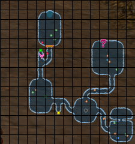
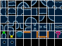

# DarkDream

A tool to predict dungeon generation in the PS2 title "Dark Cloud".

## How does it work?

### The Basics
Before generating a dungeon the game runs the following code: `srand(rand()/100000.0f);`. Since `RAND_MAX` is 231 - 1, this dramatically limits the seed count from 232 to `RAND_MAX` / 100000 + 1 (i.e. 21475).

With that information in mind, the search space becomes reasonable to brute force and generate all of the maps by "hand" without the need to reverse engineer the dungeon generation algorithm. These maps are generated and stored internally in a 20x20 grid for display on the minimap. However, the true dungeon size remains in a 15x15 subsection of this grid as seen below.

  

Through the use of [scripting](./tools/generate_dungeons.py), all 21475 maps can be precomputed in less than 4 hours. With the above tileset and the information from the [precomputed file](./res/DUNGEONS.db) any dungeon can be rendered into an image like the following dungeons.

  
  

## Known Issues

1. Limited to Divine Beast Cavern (before Xiao).
2. Unable to currently read Atla contents.
3. Unable to currently read treasure chest contents.

## Thanks

- Google's [Noto Emoji](https://github.com/googlefonts/noto-emoji) for the application's icon.
